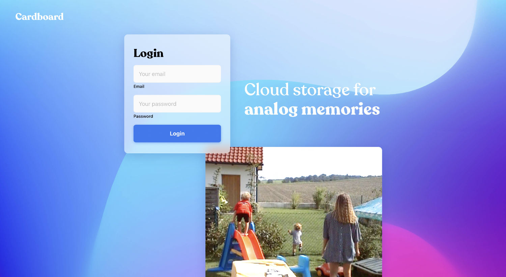
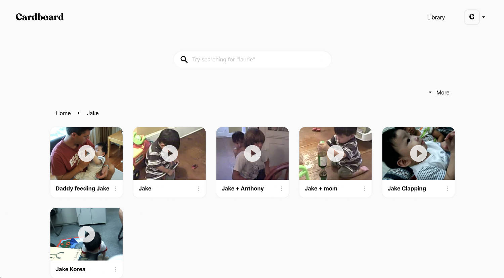
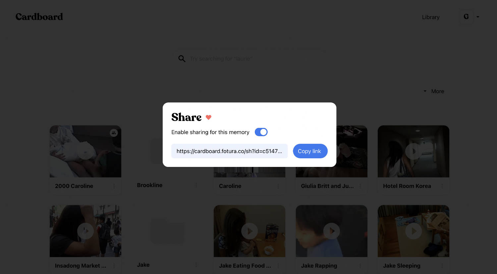

<<<<<<< HEAD
<<<<<<< HEAD
# Cardboard

TEST CREDENTIALS 
<<<<<<< HEAD
email: maxibenner@gmail.com 
password: 123456
=======
email: - 
password: -
>>>>>>> c262cfa (Update README.md)
=======
# cardboard
>>>>>>> d214ea2 (first commit)
=======
# Cardboard

A cloud storage platform for digitized home movies with the main focus on ease of use and pleasant interactions. The original version included automated clip splitting which has since been deactivated on client request. The code for it can still be found in the cardboard-api.

** Business
This repo includes the business module. It enables digitization providers to manage deliveries and send files directly to users. The business module is not production ready.
 
 
 
 
# Images

## FAQ

**Can I sign up?**
 
Unfortunately, no. Because of the lack of a payment mechanic this project is in friends & family mode. If you really want to sign up, reach out to benner@fotura.co and maybe we can work something out.
 
 
**Can I host my own version of Cardboard?**
 
<<<<<<< HEAD
Yes, everyone. I still cherish the time when a photographer suggested I retouch the brown spots on the leaves in the scincare image.
>>>>>>> 4cb506f (Update README.md)
=======
Yes. The current build is optimized for use with Wasabi cloud storage and firebase.
>>>>>>> b67cf29 (Update README.md)
